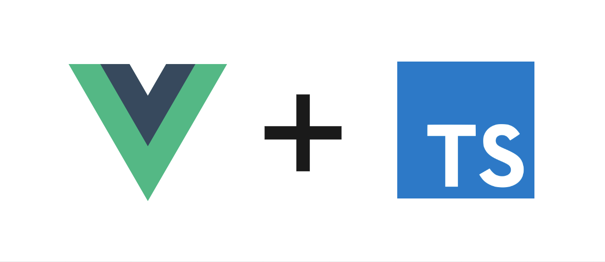

  

  <h3 align="center">An introdcution to Vue 3 and Typescript</h3>

  

    A repository for my <a href="https://dev.to/tqbit/an-introduction-to-vue-3-and-typescript-getting-started-32ne"> article series on dev.to</a>
  

  

    
    
  

## How to use this repos

- As a finishing point for the first article of the series
- As a starting point for all other articles

You can find a list of all branches right below.

## Article branches

### Getting started

Article:

- On my blog: https://blog.q-bit.me/an-introduction-to-vue-3-and-typescript-getting-started/
- On Dev.to: https://dev.to/tqbit/an-introduction-to-vue-3-and-typescript-getting-started-32ne
- Branch: https://github.com/tq-bit/vue3-typescript

### How to define properties and events

TBD

### How to access attributes and slots

TBD

### How to create functional components

TBD

### How to write a simple state management system with Vue 3's composition API

TBD

###

## Recommended IDE Setup (from the original readme)

- [VSCode](https://code.visualstudio.com/) + [Volar](https://marketplace.visualstudio.com/items?itemName=johnsoncodehk.volar)

## Type Support For `.vue` Imports in TS (from the original readme)

Since TypeScript cannot handle type information for `.vue` imports, they are shimmed to be a generic Vue component type by default. In most cases this is fine if you don't really care about component prop types outside of templates. However, if you wish to get actual prop types in `.vue` imports (for example to get props validation when using manual `h(...)` calls), you can enable Volar's Take Over mode by following these steps:

1. Run `Extensions: Show Built-in Extensions` from VSCode's command palette, look for `TypeScript and JavaScript Language Features`, then right click and select `Disable (Workspace)`. By default, Take Over mode will enable itself if the default TypeScript extension is disabled.
2. Reload the VSCode window by running `Developer: Reload Window` from the command palette.

You can learn more about Take Over mode [here](https://github.com/johnsoncodehk/volar/discussions/471).
